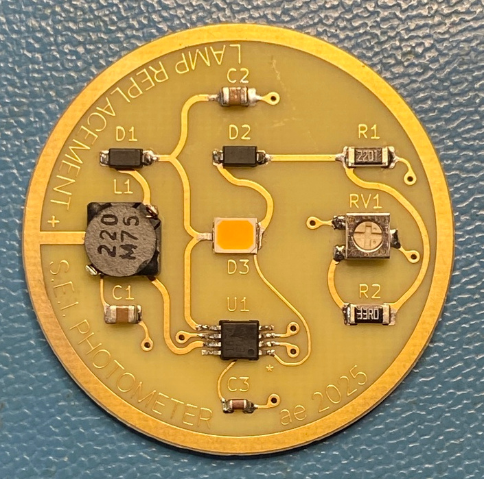

# S.E.I.-photometer
A lamp replacement board for the vintage S.E.I. photometer.

A replacement light source for the vintage S.E.I. photometer was created by someone with the name Huw[^1]. Here the schematic and board are recreated in Kicad. Datasheets for the components are included as well as any documentation on the S.E.I. photometer that we could find.

For fun, and to stay a bit with the times, I used the *Round Tracks* plugin for the PCB layout. Further, the board has no solder mask or silkscreen, but has full board ENIG gold finish for good connectivity with the battery and enclosure.

I case one needs a board, am happy to send you one at cost. 

[^1] See Documents folder for details
